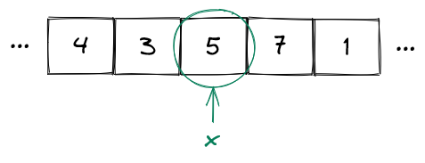
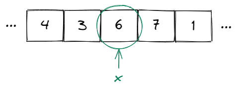

## Primitive data types

<div style="text-align: right"> <i> == is the equality operator <br> === is the one and true equality operator <br> ==== is the equality operator which transcends time and space <br> ===== is the equality operator which transcends all other equality operators <br> ======= is the equality operator which summons the UNSPEAKABLE DOOM h̷̳͓͝ě̵̞͂ ̵̮͍͊͋i̴͎͂s̵̗͒ ̷̘̤̓̅h̸͜͝ḙ̵̀r̶͈̆ȇ̶̗̱̍ ̸͕̾h̴̲̗̾̅e̷̟̋ả̶̬v̶̯́̐͜ẽ̸̛͔n̶̩̒͊ ̴̢̯̍ḣ̵̳̻e̴̙̒̓l̵͇̟̃p̶̘̑ ̷̠͛͝ŭ̴͇̯̕s̶̮͕̒ <br> — from "The Book of the Equality Operators and their Virtue" by Laozi </i> </div>

### Variables

Whenever we write programs, we need to manipulate data. This data needs to be stored somewhere and we need to be able to access it somehow. We also need to deal with the fact that when we execute a program, the values we deal with are not predictable in advance. For example we don't know which tasks a user might create. Nevertheless, we must be able to access created tasks through a predictable name like `tasks` or `createdTasks`. Therefore we need a way to put an *unpredictable* value in storage and refer to it using a *predictable* name.

A **variable** is just that - a storage location containing a value which is referred to by a symbolic name. This *sounds* really fancy, but it just means that there is a value somewhere in your storage and you can refer to that value using a predictable name (even if the value itself is not predictable).

For example you could have a variable `x` which has the value `5` (we say that `x` is equal to `5`):



Now even if the value of `x` changes (e.g. to `6`), the variable name doesn't change, only the value does. That is the variable name is still `x`, however now `x` has the value `6` (i.e. `x` is equal to `6`):



JavaScript lets you declare variables with the `let` keyword. You can assign values to variables using the **assignment operator** (`=`):

```javascript
// Declare a variable
let x;

// Assign a value to a variable
x = 10;
```

We can print the value of the variable using the `console.log` method:

```javascript
console.log(x); // 10
```

> If you follow along in the Node.js (or browser) console, you don't actually need to use the `console.log` method to print the value of a variable. Instead you can simply type the variable (or any expression for that matter) and the console will display its value.

You can also have a declaration and an assignment on a single line. In fact, this is usually the way to go:

```javascript
let y = 10;
```

The value of a variable may change over the course of a program:

```javascript
let y = 10;
console.log(y); // 10

// Assign a new value to the variable
y = 20;
console.log(y); // 20
```

This will print `10` first and then `20`.

If you want to declare a symbolic name for a value that never changes, you can declare a **constant**. This is done using the `const` keyword:

```javascript
const ten = 10;
```

If you try to reassign a value to a constant, you get an error. For example if you do

```javascript
const ten = 10;
ten = 20;
```

you get

```
Uncaught TypeError: Assignment to constant variable.
```

You will almost exclusively see us using `const` instead of `let` from now on. Reassignment is not nearly as necessary as you might think right now.

> You can also declare variables using the `var` keyword. We will not cover it here and you essentially only need to know one thing about `var` - you should *basically never use it*. It's mostly a historical artifact of the language at this point.

Any variable has a **data type** which denotes the range of values it can take and which operations can be performed on the variable. You can use the `typeof` operator to obtain the data type of a variable.

We begin with the **primitive data types**.

### Numbers

You've already encountered the `Number` data type:

```javascript
const n = 10;
console.log(typeof n); // number
```

Any integer or real number is a `Number`. So far, so obvious. However there are also some other things which have type `Number` like `Infinity`. We don't care about these for now, just keep in mind that JavaScript numbers are more than just integers and reals.

```javascript
console.log(typeof 42); // number
console.log(typeof -20); // number
console.log(typeof 3.4); // number
console.log(typeof -1.7); // number
console.log(typeof Infinity); // number
```

You can perform arithmetic on numbers using the usual arithmetic operators `+`, `-`, `*` and `/`. There is also the `%` (modulo) operator which returns the remainder of a division. Finally, there is the `**` operator which does exponentiation:

```javascript
const a = 3;
const b = 4;
console.log(a + b); // 7
console.log(a - b); // -1
console.log(a * b); // 12
console.log(a / b); // 0.75
console.log(a % b); // 3
console.log(a ** b); // 81
```

### Booleans

Another primitive type is the `Boolean` type. This allows you to represent values which are either `true` or `false`:

```javascript
const thisBookIsAwesome = true;
const thisBookSucks = false;
console.log(typeof thisBookIsAwesome); // boolean
console.log(typeof thisBookSucks); // boolean
```

You can do simple logic using the logical operators `&&` (which denotes **and**), `||` (which denotes **or**) and `!` (which denotes **not**).

The `&&` (*and*) operator takes two values and evaluates to `true` only if both values are `true` and to `false` otherwise:

```javascript
console.log(true && true); // true
console.log(false && true); // false
console.log(true && false); // false
console.log(false && false); // false
```

The `||` (*or*) operator takes two values and evaluates to `true` if *at least one* of the values is `true` (and to `false` otherwise):

```javascript
console.log(true || true); // true
console.log(false || true); // true
console.log(true || false); // true
console.log(false || false); // false
```

The `!` (*not*) operator takes a single value and simply negates it:

```javascript
console.log(!true); // false
console.log(!false); // true
```

Here is an example with all the operators together:

```javascript
const b1 = true;
const b2 = false;
console.log(b1 && b2); // false
console.log(b1 || b2); // true
console.log(!b1); // false
```

> Note that technically all the logical operators can take *any* value (not just boolean values). The result of the logical operator application is then dependent on whether the values are *truthy* or *falsy*. We will discuss this a bit later.

A boolean variable is usually the result of an expression. Often it is the result of an expression containing the **equality operator** (`===`) which allows us to compare the values of variables:

```javascript
const x1 = 5;
const x2 = 10;
const x3 = 5;
console.log(x1 === x1); // true
console.log(x1 === x2); // false
console.log(x1 === x3); // true
```

> There is also another equality operator (`==`). It can be best described as an April Fools' joke that somehow made it into the language. *Never use it*.

If you want to write *not equals* you can use `!==`:

```javascript
console.log(5 !== 10); // true
console.log(5 !== 5); // false
```

### Strings

Another primitive data type is the `String` type. A string is simply a bunch of characters and is used to represent text. Strings are usually written using single quotes in JavaScript: 

```javascript
const s = 'Some text';
console.log(typeof s); // string
```

> Note that it's also possible to write strings using double quotes, however in most projects strings are written using single quotes. We will stick to this convention.

The `+` operator works on strings and does concatenation:

```javascript
const s1 = 'MERN ';
const s2 = 'book';
console.log(s1 + s2); // MERN book
```

Note that instead of doing concatentation all the time you can also use **template strings** (also called template literals). This allows writing JavaScript expressions directly inside strings. Consider the following example:

```javascript
const s = 'world';
const greeting = `Hello ${s}!`;
console.log(greeting); // Hello world!
```

Template strings are written using backticks (*not* single quotes). They may contain so called *placeholders* which are expressions embedded inside `${...}`. These expressions can be any valid JavaScript expression that evaluates to a value implicitly convertible to a string:

```javascript
console.log(`2 + 2 = ${2 + 2}`); // 2 + 2 = 4
```

You can get the length (i.e. the number of characters) of a string like this:

```javascript
const s = 'MERN book';
console.log(s.length); // 9
```

### Undefined

Finally there is one more primitive type that is of interest to us, namely `undefined`. There is only one value of this type, which is also called `undefined`. If a variable has the value `undefined` this (quite logically) means that it hasn't been defined. For example, whenever you have a variable that has been initialized, but not assigned to, it will automatically have the value and therefore the type `undefined`.

```javascript
let someVariable;
console.log(someVariable); // undefined
console.log(typeof someVariable); // undefined
```

> Note that `string`, `number`, `boolean` and `undefined` are not the only primitive data types. Two other primitive data types are `symbol` and `bigint`. And there is one more primitive data type that we will encounter soon.

### Summary

You learned how to declare variables using `let` and constants using `const`. You also learned about numbers, strings, booleans and `undefined`.

### Further reading

* [JavaScript Guide - Grammar and types](https://developer.mozilla.org/en-US/docs/Web/JavaScript/Guide/Grammar_and_Types)
